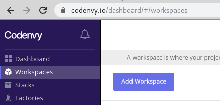
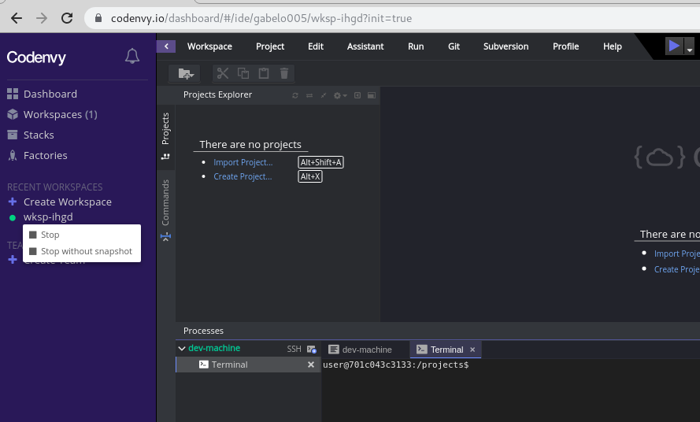
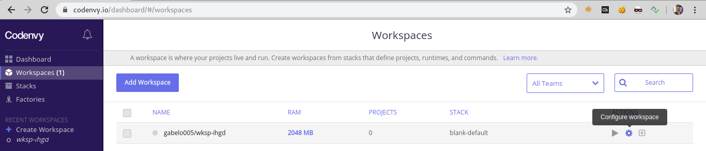

# CODENVY COMO ENTORNO DE TRABAJO

CODENVY es una plataforma web que permite crear espacios de trabajo para desarrolladores de forma instantánea, su objetivo es eliminar la necesidad de los desarrolladores de configurar o  mantener ambientes de desarrollo locales o basados en máquinas virtuales para sus  proyectos.

CODENVY permitirá mantener un entorno de de desarrollo para los laboratorios planeados de este entrenamiento sin requerir la instalación de software adicional en los equipos de los asistentes.


## CONFIGURACIÓN DEL ENTORNO DE TRABAJO EN CODENVY

1. Ingresar a la plataforma a través de la dirección web [https://codenvy.com](https://codenvy.com/)

   

2. Crear una cuenta en la plataforma o iniciar sesión a través de OAuth.

3. Ingresar a la opción **Workspaces** del menú lateral izquierdo y hacer clic en el botón **Add Workspace** 
   

4. Crear un espacio de trabajo de prueba con cualquier configuración por ejemplo: `NAME: por defecto`, `TEAM: personal`, `SELECT STACK: Blank`, `RAM: 2 GB` y hacer clic en el botón `CREATE`.

   > Esta configuración se sobrescribirá más adelante. 
   
5. Al finalizar el paso anterior se tendrá un entorno de prueba con un editor de código y una terminal de un contenedor de Linux. A continuación se cambiará la configuración del espacio de trabajo para incorporar una aplicación desarrollada a propósito para ser vulnerable.

6. Parar la ejecución del espacio de trabajo, haciendo clic derecho sobre el espacio de trabajo creado, luego hacer clic sobre la opción `Stop without snapshot` 

   

7. Regresar al menú de los espacios de trabajo haciendo clic en el menú `Workspaces` y allí hacer clic en el botón de configuración del espacio previamente creado.

   

8. En la opción `config` reemplazar el contenido por el siguiente:

   ```json
   {
     "environments": {
       "default": {
         "machines": {
           "dev-machine": {
             "attributes": {
               "memoryLimitBytes": "3221225472"
             },
             "servers": {
               "nodeview": {
                 "port": "3000",
                 "properties": {},
                 "protocol": "http"
               }
             },
             "agents": [
               "org.eclipse.che.ssh",
               "org.eclipse.che.ws-agent",
               "org.eclipse.che.terminal",
               "org.eclipse.che.exec"
             ]
           }
         },
         "recipe": {
           "location": "eclipse/debian_jre",
           "type": "dockerimage"
         }
       }
     },
     "defaultEnv": "default",
     "projects": [
       {
         "links": [],
         "name": "gcalleft-codenvyjshop",
         "attributes": {
           "contribute_to_branch": [
             "master"
           ],
           "commands": [
             "{\"commandLine\":\"cd /projects/gcalleft-codenvyjshop\\nnpm start\", \"name\":\"juiceshop run\", \"attributes\":{\"previewUrl\":\"${server.port.3000}\", \"goal\":\"Run\"}, \"type\":\"custom\"}",
             "{\"commandLine\":\"curl -sL https://deb.nodesource.com/setup_12.x | sudo -E bash -\\nsudo apt-get install -y nodejs\\ncd /projects/gcalleft-codenvyjshop/\\ngit checkout -- .\\ngit checkout jshopv8.7.3\\ncd /projects/gcalleft-codenvyjshop/frontend\\nnpm i typescript@3.2.4\\ncd /projects/gcalleft-codenvyjshop/\\nnpm i\\necho \\\"Finish\\\"\", \"name\":\"OnCreate machine\", \"attributes\":{\"previewUrl\":\"\", \"goal\":\"Run\"}, \"type\":\"custom\"}",
             "{\"commandLine\":\"cd /projects/gcalleft-codenvyjshop/\\ngit checkout -- .\\ngit checkout jshopv8.7.3\\ncd /projects/gcalleft-codenvyjshop/frontend\\nnpm i typescript@3.2.4\\ncd /projects/gcalleft-codenvyjshop/\\nnpm i\\necho \\\"Finish\\\"\", \"name\":\"OnRestart Snapshot\", \"attributes\":{\"previewUrl\":\"\", \"goal\":\"Run\"}, \"type\":\"custom\"}"
           ]
         },
         "type": "blank",
         "source": {
           "location": "https://github.com/gcalleft/codenvyjshop.git",
           "type": "git",
           "parameters": {}
         },
         "path": "/gcalleft-codenvyjshop",
         "description": "codenvy juice shop",
         "problems": [],
         "mixins": [
           "pullrequest"
         ]
       }
     ],
     "name": "juiceshop8",
     "commands": [],
     "links": []
   } 
   ```

9. Hacer clic en el botón `SAVE` de la parte inferior para guardar la nueva configuración del espacio de trabajo.

10. Iniciar el nuevo entorno de trabajo haciendo clic en el nuevo nombre `juiceshop8` o en el botón `RUN` 

    

## EJECUCIÓN DE LA APLICACIÓN VULNERABLE

Con el fin de ejecutar la aplicación de una forma simple, se tienen tres opciones para ejecutarla y preparar el entorno de desarrollo, estas opciones son:`OnCreate machine` y`OnRestart Snapshot` y `juiceshop run`. Codenvy cuenta con algunas limitaciones como el tiempo de inactividad en la plataforma lo que ocasiona que el espacio de trabajo sea pausado.   

**OnCreate machine**: Se debe ejecutar una sola vez después de crear el nuevo espacio de trabajo con el archivo de configuración del paso 8, este opción toma aproximadamente 10 min.

**OnRestart Snapshot**: Se debe ejecutar cada vez que se inicia el espacio de trabajo, esto puede darse al iniciar una nueva sesión de trabajo, debido a la pausa del espacio de trabajo al superarse el timeout de a plataforma, o incluso tras algún bloqueo de la misma.

**juiceshop run**: Se debe ejecutar cada vez que se altere el código de la aplicación.

> Nota: Una vez se ejecute la opción **OnRestart Snapshot**, se perderán los cambios realizados en el código, esto se hace con el fin de mantener estable la plataforma de laboratorios.


