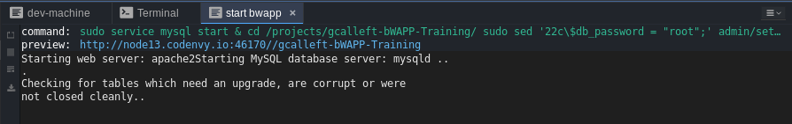

# CODENVY COMO ENTORNO DE TRABAJO

CODENVY es una plataforma web que permite crear espacios de trabajo para desarrolladores de forma instantánea, su objetivo es eliminar la necesidad de los desarrolladores de configurar o  mantener ambientes de desarrollo locales o basados en máquinas virtuales para sus  proyectos.

CODENVY permitirá mantener un entorno de de desarrollo para los laboratorios planeados de este entrenamiento sin requerir la instalación de software adicional en los equipos de los asistentes.


## CONFIGURACIÓN DEL ENTORNO DE TRABAJO EN CODENVY

1. Ingresar a la plataforma a través de la dirección web [https://codenvy.com](https://codenvy.com/)

   

2. Crear una cuenta en la plataforma o iniciar sesión a través de OAuth.

3. Ingresar a la opción **Workspaces** del menú lateral izquierdo y hacer clic en el botón **Add Workspace** 
   

4. Crear un espacio de trabajo de prueba con cualquier configuración por ejemplo: `NAME: por defecto`, `TEAM: personal`, `SELECT STACK: Blank`, `RAM: 2 GB` y hacer clic en el botón `CREATE`.

   > Esta configuración se sobrescribirá más adelante. 
   
5. Al finalizar el paso anterior se tendrá un entorno de prueba con un editor de código y una terminal de un contenedor de Linux. A continuación se cambiará la configuración del espacio de trabajo para incorporar una aplicación desarrollada a propósito para ser vulnerable.

6. Parar la ejecución del espacio de trabajo, haciendo clic derecho sobre el espacio de trabajo creado, luego hacer clic sobre la opción `Stop without snapshot` 

   

7. Regresar al menú de los espacios de trabajo haciendo clic en el menú `Workspaces` y allí hacer clic en el botón de configuración del espacio previamente creado.

   

8. En la opción `config` reemplazar el contenido por el siguiente:

   ```json
   {
     "environments": {
       "default": {
         "machines": {
           "dev-machine": {
             "attributes": {
               "memoryLimitBytes": "2147483648"
             },
             "servers": {},
             "agents": [
               "org.eclipse.che.ls.php",
               "org.eclipse.che.ssh",
               "org.eclipse.che.ws-agent",
               "org.eclipse.che.terminal",
               "org.eclipse.che.exec"
             ]
           }
         },
         "recipe": {
           "location": "eclipse/php:5.6",
           "type": "dockerimage"
         }
       }
     },
     "defaultEnv": "default",
     "projects": [
       {
         "links": [],
         "name": "gcalleft-bWAPP-Training",
         "attributes": {
           "contribute_to_branch": [
             "master"
           ],
           "commands": [
             "{\"commandLine\":\"sudo service mysql start &\\ncd /projects/gcalleft-bWAPP-Training/\\nsudo sed '22c\\\\$db_password = \\\"root\\\";' admin/settings.php > admin/settings2.php\\nsudo mv admin/settings2.php admin/settings.php\\nsudo service apache2 start &\", \"name\":\"start bwapp\", \"attributes\":{\"goal\":\"Run\", \"previewUrl\":\"http://${server.port.80}/${current.project.relpath}\"}, \"type\":\"custom\"}"
           ]
         },
         "type": "blank",
         "source": {
           "location": "https://github.com/gcalleft/bWAPP-Training.git",
           "type": "git",
           "parameters": {}
         },
         "path": "/gcalleft-bWAPP-Training",
         "description": "bWAPP Training",
         "problems": [],
         "mixins": [
           "pullrequest"
         ]
       }
     ],
     "name": "bwapp",
     "commands": [
       {
         "commandLine": "sudo service apache2 restart",
         "name": "restart apache",
         "attributes": {
           "goal": "Run",
           "previewUrl": "http://${server.port.80}/${current.project.relpath}"
         },
         "type": "custom"
       },
       {
         "commandLine": "[ -z ${editor.current.file.path} ] && echo \"Open a PHP file in the editor before executing this command.\" || QUERY_STRING=\"start_debug=1&debug_host=localhost&debug_port=10137\" php ${editor.current.file.path}",
         "name": "debug php script",
         "attributes": {
           "goal": "Debug",
           "previewUrl": ""
         },
         "type": "custom"
       },
       {
         "commandLine": "[ -z ${editor.current.file.path} ] && echo \"Open a PHP file in the editor before executing this command.\" || php ${editor.current.file.path}",
         "name": "run php script",
         "attributes": {
           "goal": "Run",
           "previewUrl": ""
         },
         "type": "custom"
       },
       {
         "commandLine": "sudo service apache2 stop &\nsudo service mysql stop &",
         "name": "stop apache and mysql",
         "attributes": {
           "goal": "Run",
           "previewUrl": ""
         },
         "type": "custom"
       }
     ],
     "links": []
   }
   ```

9. Hacer clic en el botón `SAVE` de la parte inferior para guardar la nueva configuración del espacio de trabajo.

10. Iniciar el nuevo entorno de trabajo haciendo clic en el nuevo nombre `bwapp` o en el botón `RUN` 

    

## EJECUCIÓN DE LA APLICACIÓN VULNERABLE

Con el fin de ejecutar la aplicación de una forma simple, se tienen tres opciones para ejecutarla y preparar el entorno de desarrollo, estas opciones son:`restart apache`,`run php script`, `stop apache and mysql` y `start bwapp`. Codenvy cuenta con algunas limitaciones como el tiempo de inactividad en la plataforma lo que ocasiona que el espacio de trabajo sea pausado.   

**restart apache**: Se ejecuta para reiniciar el servidor web apache.

**run php script**: Se ejecuta para probar un script php.

**stop apache and mysql**: Se ejecuta para parar los servicios apache y mysql.

**start bwapp**: Se ejecuta para prepara el ambiente para que la aplicación web se pueda ejecutar.


**Ejecución de la aplicación vulnerable intencionalmente**

1. Ejecute la opción `start bwapp`. 

2. Al finalizar la ejecución en la parte inferior estará la dirección web donde se encuentra disponible la aplicación.

   

3. Al ingresar al enlace la aplicación genera un mensaje de error en la conexión a la base de datos, debido a que la base de datos de la aplicación no se ha creado.
   

4. Para crear la base de datos e ingresar los datos iniciales, se debe ingresar al archivo `install.php`, y hacer clic en enlace `here`.

   

